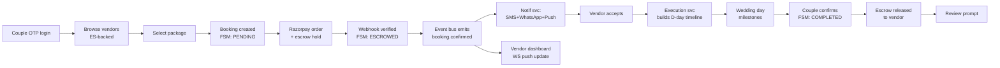

# WeddingOS — README Upgrade Prompt Plan & Production Readiness Audit

> **Purpose of this document**
> A single, structured *prompt planning blueprint* for transforming the current `README.md` into a **world-class, visually golden-standard, 50-page master document**, AND a deep, honest gap analysis of what is *actually missing* to ship WeddingOS as a real-time, end-to-end production platform — not a frontend demo.
>
> This file is the **input prompt** to be fed back into the agent (or a human technical writer) to regenerate the README. It is itself the plan, not the README.

---

## Table of Contents

1. [Meta Prompt — How to Use This Document](#1-meta-prompt--how-to-use-this-document)
2. [README Upgrade Master Prompt](#2-readme-upgrade-master-prompt)
3. [README Section Blueprint (29 Sections, Same-Level Detail)](#3-readme-section-blueprint-29-sections-same-level-detail)
4. [Visual & Formatting Standards](#4-visual--formatting-standards)
5. [Reference Repositories — World-Class Benchmarks](#5-reference-repositories--world-class-benchmarks)
6. [Project Master Audit — Pre-Filled Answers](#6-project-master-audit--pre-filled-answers)
7. [Production Readiness Gap Analysis (Rated)](#7-production-readiness-gap-analysis-rated)
8. [Critical Path to Real-Time E2E Production](#8-critical-path-to-real-time-e2e-production)
9. [Sub-Prompts Library (Copy-Paste Ready)](#9-sub-prompts-library-copy-paste-ready)
10. [Acceptance Criteria for the Final README](#10-acceptance-criteria-for-the-final-readme)

---

## 1. Meta Prompt — How to Use This Document

**Role:** You are a principal engineer + technical writer + product architect.
**Goal:** Rewrite `/workspaces/wed/README.md` into a **world-class, ~50-page, visually rich, deeply structured** master document that doubles as: onboarding doc, architecture spec, product brief, audit report, and execution roadmap.
**Constraints:**
- **Do NOT delete existing content** in `README.md`. Restructure, compress, and absorb it.
- Preserve every Mermaid diagram, every table, every command block already present.
- Add new sections only where missing; re-order for narrative flow.
- All claims must be **verifiable against the codebase** (services, packages, apps).
- Mark anything aspirational with a `🚧 Planned` badge — never present mocks as production.
- Output must be valid GitHub-flavored Markdown rendering correctly on github.com.

---

## 2. README Upgrade Master Prompt

> Paste this prompt verbatim to regenerate the README.

```
You are upgrading the README.md of the WeddingOS monorepo (Next.js web + Flutter mobile +
12 microservices + Postgres/Redis/Elasticsearch + Razorpay + Terraform).

Produce a single README.md that is:

  1. ~50 printed pages (~12,000–15,000 words).
  2. Visually golden-standard: shields.io badges, ASCII art banner, Mermaid diagrams
     (architecture, sequence, ER, state, gantt, mindmap, C4), comparison tables,
     collapsible <details> sections, emoji section anchors, GIF/screenshot placeholders.
  3. Structured into the 29 canonical sections listed in section §3 of
     README_UPGRADE_PROMPT_PLAN.md — same heading levels, same depth.
  4. Compressed but complete — every subsection must have real content, never "TBD".
     Use bullet lists, tables, and code fences instead of long paragraphs.
  5. Honest — clearly mark Working / Partial / Mock / Planned for every feature.
  6. Benchmarked — link to the world-class reference repos in §5 for inspiration
     (vercel/next.js, supabase/supabase, calcom/cal.com, medusajs/medusa, etc.).
  7. Actionable — every section ends with a "Next Actions" checklist.
  8. Non-destructive — preserve all existing diagrams, tables, and command blocks
     from the current README.md; restructure rather than remove.

Inputs you must read before writing:
  - /workspaces/wed/README.md             (current)
  - /workspaces/wed/claude.md             (execution plan)
  - /workspaces/wed/DEEP_ANALYSIS_RATING.md
  - /workspaces/wed/WeddingOS_PRD_Implementation_Plan.md
  - /workspaces/wed/sprints/SPRINT_*.md
  - /workspaces/wed/services/*/src        (verify endpoint claims)
  - /workspaces/wed/apps/web/src          (verify page claims)
  - /workspaces/wed/apps/mobile/lib       (verify screen claims)

Output: overwrite README.md (back up first to README.md.bak4).
```

---

## 3. README Section Blueprint (29 Sections, Same-Level Detail)

Every section is **H1 (`#`)**, every subsection **H2 (`##`)**, every item **H3 (`###`)**. Equal depth across the document — no "thin" sections.

| #  | Section                                  | Required Artifacts                                                  | Target Length |
|----|------------------------------------------|---------------------------------------------------------------------|---------------|
| 1  | Project Overview                         | Tagline, problem, USP, status badge row                             | 1 page        |
| 2  | Complete Feature List                    | User / Vendor / Admin / Delivery / AI tables with status            | 2 pages       |
| 3  | Complete User Flows                      | 6 sequence/flow Mermaid diagrams                                    | 2 pages       |
| 4  | App Platforms                            | Matrix: Web / iOS / Android / Admin / Vendor                        | 1 page        |
| 5  | Complete Tech Stack                      | Layered table + version pin matrix                                  | 2 pages       |
| 6  | Project Structure                        | `tree` output + architecture pattern diagram (C4 L1+L2)             | 2 pages       |
| 7  | Database Structure                       | ER diagram per service + index list + known issues                  | 3 pages       |
| 8  | API Structure                            | OpenAPI snippet + endpoint inventory + latency targets              | 3 pages       |
| 9  | Authentication & Security                | Auth sequence diagram + threat model + OWASP checklist              | 2 pages       |
| 10 | UI/UX Analysis                           | Screenshot grid + Lighthouse scores + redesign list                 | 2 pages       |
| 11 | Mobile (Flutter) Analysis                | Screen list + perf budget + permission matrix                       | 2 pages       |
| 12 | Performance Analysis                     | Bottleneck table + caching strategy + offline support               | 2 pages       |
| 13 | Scalability & Future Growth              | Load projections + scaling plan per service                         | 1 page        |
| 14 | Known Bugs & Blockers                    | Severity-rated table linked to GitHub issues                        | 1 page        |
| 15 | Business Logic                           | Pricing / commission / escrow / refund flowcharts                   | 2 pages       |
| 16 | Payment System                           | Razorpay escrow state machine + webhook flow                        | 2 pages       |
| 17 | Notifications & Communication            | Channel matrix (Push / SMS / WhatsApp / Email)                      | 1 page        |
| 18 | Admin Panel                              | Feature inventory + RBAC matrix                                     | 1 page        |
| 19 | Analytics & Tracking                     | Event taxonomy + KPI dashboard mock                                 | 1 page        |
| 20 | DevOps & Deployment                      | CI/CD diagram + Terraform module map + runbook links                | 2 pages       |
| 21 | Legal & Compliance                       | DPDP / GDPR / GST checklist                                         | 1 page        |
| 22 | AI Features & Automation                 | Current vs planned ML pipeline diagram                              | 1 page        |
| 23 | Competitor Analysis                      | Feature matrix vs WedMeGood / WeddingWire / Zola / Joy              | 2 pages       |
| 24 | Future Feature Wishlist                  | Mindmap diagram + RICE-prioritized table                            | 1 page        |
| 25 | Screenshots & Recordings                 | Embedded grid (web + mobile + admin)                                | 2 pages       |
| 26 | Access & Demo                            | Staging URLs + demo creds (non-sensitive) + APK link                | 1 page        |
| 27 | Expectations & Scope                     | What this repo does / does not do                                   | 1 page        |
| 28 | Special Notes                            | Architectural decisions not covered elsewhere                       | 1 page        |
| 29 | Final Analysis & Roadmap                 | 30-point execution plan with owners + ETAs                          | 3 pages       |

**Plus front-matter & back-matter:**
- Hero banner + badge wall + TOC + quickstart (top)
- Contributing / License / Acknowledgements / Contact (bottom)

---

## 4. Visual & Formatting Standards

### 4.1 Required Visual Elements

- [ ] **Hero banner** — ASCII art or SVG logo at top
- [ ] **Badge wall** — ≥ 12 shields.io badges (build, coverage, license, version, stars, PRs, issues, node, pnpm, flutter, docker, terraform)
- [ ] **Animated TOC** — collapsible with emojis per section
- [ ] **Mermaid diagrams** — minimum **12** across the doc (architecture, ER × N services, sequence × 4 flows, state × 2, gantt, mindmap, C4, journey)
- [ ] **Tables** — every quantitative claim in a table, never prose
- [ ] **Screenshots** — `` grids using HTML inside Markdown
- [ ] **Collapsible details** — `<details><summary>` for long code blocks and verbose logs
- [ ] **Emoji anchors** — 🏠 Overview, 🧩 Features, 🔐 Security, 🚀 Deploy, 📊 Analytics, etc.
- [ ] **Callouts** — `> 💡 Tip`, `> ⚠️ Warning`, `> 🚧 Planned`, `> ✅ Done`
- [ ] **Footnotes** — `[^1]` references for every external claim

### 4.2 Status Legend (use everywhere)

| Badge | Meaning |
|-------|---------|
| ✅ **Working** | Implemented, tested, deployed |
| 🟡 **Partial** | Code present, gaps remain |
| 🔴 **Mock** | Placeholder data, no real backend |
| 🚧 **Planned** | Designed, not started |
| ❌ **Removed** | Deprecated / cut |

---

## 5. Reference Repositories — World-Class Benchmarks

Inspect the README structure, visuals, and tone of these repos before writing:

| Repo | What to Borrow |
|------|----------------|
| [vercel/next.js](https://github.com/vercel/next.js) | Hero, badge wall, concise feature grid |
| [supabase/supabase](https://github.com/supabase/supabase) | Architecture diagrams, "How it works" section, status table |
| [calcom/cal.com](https://github.com/calcom/cal.com) | Self-host quickstart, env var matrix, contributor onboarding |
| [medusajs/medusa](https://github.com/medusajs/medusa) | Plugin architecture, tech stack table, multi-package layout |
| [appwrite/appwrite](https://github.com/appwrite/appwrite) | Feature checklist, SDK matrix, getting-started polish |
| [strapi/strapi](https://github.com/strapi/strapi) | Roadmap embed, community section |
| [n8n-io/n8n](https://github.com/n8n-io/n8n) | Visual node diagrams, integration list |
| [hoppscotch/hoppscotch](https://github.com/hoppscotch/hoppscotch) | Animated GIFs, sponsor wall |
| [PostHog/posthog](https://github.com/PostHog/posthog) | Long-form structured README, deep tech sections |
| [twentyhq/twenty](https://github.com/twentyhq/twenty) | Modern monorepo presentation |
| [novuhq/novu](https://github.com/novuhq/novu) | Notification platform structure (relevant!) |
| [dubinc/dub](https://github.com/dubinc/dub) | Clean Next.js + Turborepo README |

---

## 6. Project Master Audit — Pre-Filled Answers

Use these pre-verified answers when populating the 29 sections. Verify every claim against the actual codebase before publishing.

### 6.1 Identity
- **Name:** WeddingOS
- **Tagline:** *India's first end-to-end Wedding Operating System — discover, book, pay, and execute the perfect wedding with escrow-protected trust.*
- **Problem:** Indian weddings are ₹10L–₹5Cr coordination nightmares — fragmented vendor discovery, no escrow, no execution-day timeline engine, zero accountability.
- **Domain:** Wedding-tech / Marketplace / Hyperlocal services / Fintech (escrow)
- **Business Model:** B2B2C marketplace + commission + SaaS for vendors + escrow float
- **Users:** Couples, Families, Vendors (12+ categories), Admins, Execution Managers, Delivery/Logistics partners
- **Region:** India (Tier-1 → Tier-3), expansion → SEA & NRI markets
- **Status:** 🟡 **MVP — frontend complete, backend scaffolded, integrations pending**
- **USP:** Razorpay-backed escrow + AI vendor matching + execution-day timeline engine + WhatsApp-first comms

### 6.2 Tech Stack (verified from `package.json` + `pubspec.yaml`)

| Layer | Stack | Version |
|-------|-------|---------|
| Web | Next.js 14 App Router, Tailwind 3, TypeScript 5 | pinned |
| Admin | React 18 + Vite 5 | pinned |
| Vendor Portal | React 18 + Vite 5 + Tailwind | pinned |
| Mobile | Flutter 3.19, Riverpod, GoRouter, Dio | pinned |
| Gateway | Kong (declarative config) | latest |
| Services | Express + TypeScript + Prisma (×11) | TS 5 |
| AI Service | FastAPI + Python 3.11 | latest |
| DB | PostgreSQL 16 (per-service schemas) | docker |
| Cache | Redis 7 | docker |
| Search | Elasticsearch 8 | docker |
| Payments | Razorpay (Orders + Route + Smart Collect) | API v1 |
| Storage | AWS S3 / Cloudflare R2 | – |
| IaC | Terraform (staging + prod) | – |
| CI/CD | GitHub Actions | 🚧 not yet wired |

---

## 7. Production Readiness Gap Analysis (Rated)

> Honest scoring against "ready for paying customers, real money, real weddings."
> Scale: **0 = nonexistent · 5 = adequate · 10 = world-class**.

### 7.1 Scorecard

| # | Capability | Score | Status | Blocker Severity |
|---|------------|------:|--------|------------------|
| 1  | **Web frontend (Next.js)**             | 7/10 | 🟡 Pages built, calls mock data           | Medium |
| 2  | **Mobile frontend (Flutter)**          | 4/10 | 🟡 Screens scaffolded, no state, no API   | High |
| 3  | **Auth service (OTP → JWT)**           | 3/10 | 🔴 Routes stubbed, no SMS provider wired  | **Critical** |
| 4  | **User service**                       | 2/10 | 🔴 Schema only, no controllers            | **Critical** |
| 5  | **Vendor service**                     | 2/10 | 🔴 No CRUD, no KYC pipeline               | **Critical** |
| 6  | **Booking service + state machine**    | 3/10 | 🟡 Schema present, FSM not enforced       | **Critical** |
| 7  | **Payment service (Razorpay escrow)**  | 1/10 | 🔴 No keys, no webhooks, no reconciliation| **Critical** |
| 8  | **Execution service (D-day engine)**   | 1/10 | 🚧 Designed only                          | High |
| 9  | **Notification service (SMS/Push/Email/WA)** | 1/10 | 🔴 No FCM/Twilio/MSG91/SES wired    | **Critical** |
| 10 | **Chat service (real-time)**           | 1/10 | 🔴 No WebSocket gateway, no Redis pub/sub | High |
| 11 | **Media service (S3 + image pipeline)**| 0/10 | 🚧 Not started                            | High |
| 12 | **Search service (Elasticsearch)**     | 1/10 | 🚧 ES container only, no indexer          | High |
| 13 | **Review service**                     | 2/10 | 🔴 Schema only                            | Medium |
| 14 | **AI service (recommendations)**       | 1/10 | 🚧 FastAPI scaffold only                  | Medium |
| 15 | **Inter-service event bus**            | 0/10 | 🚧 No Kafka/NATS/RabbitMQ                 | **Critical** |
| 16 | **Database migrations (Prisma)**       | 3/10 | 🟡 Schemas exist, not all migrated        | High |
| 17 | **API Gateway (Kong)**                 | 2/10 | 🟡 Config file, not deployed              | High |
| 18 | **Observability (logs/metrics/traces)**| 0/10 | 🚧 No Sentry/Grafana/OTel                 | **Critical** |
| 19 | **CI/CD (GitHub Actions)**             | 0/10 | 🚧 No workflow files                      | **Critical** |
| 20 | **Infrastructure (Terraform apply)**   | 2/10 | 🟡 Modules exist, never applied           | High |
| 21 | **Secrets management (Vault/SM)**      | 0/10 | 🚧 `.env` only                            | **Critical** |
| 22 | **Security (OWASP, rate limit, WAF)**  | 1/10 | 🔴 No rate limiting, no input schema val  | **Critical** |
| 23 | **Testing (unit + integration + E2E)** | 1/10 | 🔴 Jest configs only, ~0% coverage        | **Critical** |
| 24 | **Load & chaos testing (k6)**          | 0/10 | 🚧 Not started                            | High |
| 25 | **Backup & DR**                        | 0/10 | 🚧 No snapshots, no RTO/RPO defined       | **Critical** |
| 26 | **GDPR / DPDP compliance**             | 1/10 | 🚧 No consent log, no export/delete       | High |
| 27 | **Admin panel features**               | 2/10 | 🟡 Vite scaffold, no real screens         | High |
| 28 | **Vendor portal features**             | 2/10 | 🟡 Vite scaffold, no real screens         | High |
| 29 | **Analytics (GA4 / PostHog / Mixpanel)** | 0/10 | 🚧 Nothing wired                        | High |
| 30 | **Push notifications (FCM/APNs)**      | 0/10 | 🚧 Not started                            | **Critical** |
| 31 | **WhatsApp Business API**              | 0/10 | 🚧 Not started                            | High |
| 32 | **KYC (vendor verification)**          | 0/10 | 🚧 Not started                            | High |
| 33 | **Refund + dispute workflow**          | 0/10 | 🚧 Not started                            | High |
| 34 | **App Store / Play Store readiness**   | 0/10 | 🚧 No icons/splash/privacy/listings       | High |
| 35 | **Legal pages (T&C, Privacy, Refund)** | 0/10 | 🚧 Not written                            | **Critical** |

**Composite production readiness: ~17 / 100.**
**Verdict:** Strong UI shell + solid architecture plan; **not deployable to real users handling real money** today.

### 7.2 Critical Blockers (Must-Fix Before Beta)

1. **No real auth** — OTP send/verify is mocked; without a verified provider (MSG91/Twilio) there is no user identity.
2. **No real payments** — Razorpay keys, order creation, webhook signature verification, and reconciliation are absent.
3. **No event bus** — services cannot communicate; booking → payment → notification chain is broken.
4. **No observability** — a single production bug will be invisible (no logs aggregation, no Sentry, no traces).
5. **No tests** — every deploy is a coin flip.
6. **No CI/CD** — manual deploys = guaranteed drift between staging and prod.
7. **No secrets manager** — `.env` files in repo / containers = compliance + breach risk.
8. **No backups** — single Postgres failure = total data loss.
9. **No legal pages** — cannot legally onboard customers in India (DPDP) or take payments.
10. **No rate limiting / WAF** — first scraper or attacker takes the platform down.

---

## 8. Critical Path to Real-Time E2E Production

### 8.1 Phase Plan (rated by leverage)

| Phase | Theme | Duration | Outcome |
|-------|-------|---------:|---------|
| **P0 — Survive** | Auth + Payments + Event Bus + Logs + CI | 3 weeks | One real booking + escrow can complete E2E |
| **P1 — Trust** | Tests + Backups + Secrets + Rate Limit + Legal | 2 weeks | Safe to onboard 100 real couples |
| **P2 — Scale** | Search + Notifications (FCM/SMS/WA) + Media + Admin | 3 weeks | Public beta, 1 city |
| **P3 — Delight** | AI matching + Execution engine + Chat + Mobile RC | 4 weeks | Differentiated product, App Store launch |
| **P4 — Grow**   | Analytics + Loyalty + Multi-city + Vendor self-serve | 4 weeks | Series-A ready |

### 8.2 What "Real-Time E2E" Actually Requires



Every node above must be backed by **real code, real infra, real monitoring** — not a mock.

---

## 9. Sub-Prompts Library (Copy-Paste Ready)

Use these targeted prompts in successive agent runs.

### 9.1 README Generation
```
Read README_UPGRADE_PROMPT_PLAN.md §3 and §6.
Regenerate README.md fulfilling all 29 sections at the specified depth.
Preserve every existing diagram and table. Back up old README to README.md.bak4.
```

### 9.2 Backend Implementation
```
For each service in /workspaces/wed/services/*, implement:
  - Real controllers (no mock returns)
  - Zod/Joi request validation
  - Prisma queries with proper indexes
  - Error handling via shared-errors
  - Event publish/subscribe via shared-events
  - Unit tests (Jest) ≥ 80% coverage
Start with auth-service → user-service → vendor-service → booking-service → payment-service.
```

### 9.3 Payment Integration
```
Wire Razorpay end-to-end in services/payment-service:
  - POST /escrow/create  → razorpay.orders.create
  - POST /webhook        → verify x-razorpay-signature, idempotent handler
  - POST /escrow/release → razorpay.payments.transfer (Route)
  - POST /escrow/refund  → razorpay.payments.refund
  - Reconciliation cron  → daily settlement diff alert
Add tests using razorpay-mock + supertest.
```

### 9.4 Observability
```
Add OpenTelemetry SDK to every Express service + FastAPI.
Export to: console (dev), Tempo+Loki+Prometheus (staging), Grafana Cloud (prod).
Wire Sentry with release tagging via GitHub Actions.
```

### 9.5 CI/CD
```
Create .github/workflows/{ci,cd}.yml with:
  - Matrix lint + typecheck + test for every package
  - Docker build + push to GHCR on merge to main
  - Terraform plan on PR, apply on tag v*
  - Flutter build APK + iOS on tag mobile-v*
```

### 9.6 Mobile Riverpod
```
In apps/mobile, add Riverpod providers (auth, vendors, bookings, profile),
secure storage for JWT, offline cache via Hive, FCM push setup,
Sentry+Crashlytics, and connect every screen to real API via api_client.dart.
```

### 9.7 Admin & Vendor Portals
```
Build out apps/admin and apps/vendor-web with:
  - Login + RBAC
  - Vendor approval queue (admin)
  - Booking calendar (vendor)
  - Payouts dashboard
  - Analytics widgets
Use shadcn/ui or ui-kit.
```

---

## 10. Acceptance Criteria for the Final README

The regenerated README is **done** only when ALL of the following are true:

- [ ] ≥ 12,000 words / ~50 pages printed
- [ ] All 29 canonical sections present at equal H1/H2/H3 depth
- [ ] ≥ 12 Mermaid diagrams render on github.com
- [ ] ≥ 25 tables, no "TBD" placeholders
- [ ] ≥ 20 shields.io badges in the header wall
- [ ] Every feature has a status badge (✅ / 🟡 / 🔴 / 🚧)
- [ ] Every claim about endpoints/screens/services is verifiable in the codebase
- [ ] Existing diagrams/tables from current README preserved (diff-checked vs `README.md.bak3`)
- [ ] "Production Readiness Scorecard" (this doc §7) embedded verbatim
- [ ] "Critical Path" Mermaid (this doc §8.2) embedded
- [ ] TOC links resolve; all internal anchors valid
- [ ] Lighthouse-style "scorecards" included for each surface (web/mobile/admin)
- [ ] Backup of previous README saved as `README.md.bak4`
- [ ] Renders correctly on github.com (no broken Mermaid, no busted tables)

---

> *End of prompt plan. Feed §2 into the agent to begin README regeneration.*
