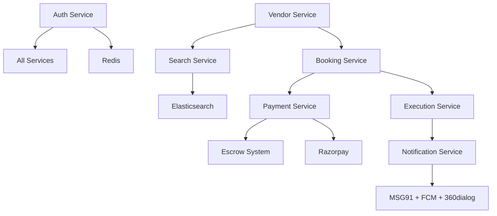

# WEDDING OS — Implementation Plan & Sprint Breakdown

> Complete sprint-level plan derived from PRD v1.0 + Vol3 Master Bible
> Last Updated: May 2026

---

## Table of Contents

1. [Phase Overview](#phase-overview)
2. [Epics & User Stories](#epics--user-stories)
3. [Phase 1: Validation (Weeks 1–8)](#phase-1-validation-weeks-18)
4. [Phase 2: MVP (Weeks 9–22)](#phase-2-mvp-weeks-922)
5. [Phase 3: Traction (Weeks 23–42)](#phase-3-traction-weeks-2342)
6. [Phase 4: Differentiation (Weeks 43–72)](#phase-4-differentiation-weeks-4372)
7. [Phase 5: Scale (Week 73+)](#phase-5-scale-week-73)
8. [Dependencies & Risk Register](#dependencies--risk-register)
9. [Definition of Done](#definition-of-done)
10. [Go/No-Go Criteria per Phase](#gono-go-criteria-per-phase)

---

## Phase Overview

| Phase | Duration | Sprints | Goal | Revenue Target | Key Deliverable |
|-------|---------|---------|------|---------------|----------------|
| **1. Validation** | Month 0–2 (8 weeks) | S1–S4 | Prove demand, no-code | ₹0 | Landing page + 50 vendors + 10 couples |
| **2. MVP** | Month 2–5 (14 weeks) | S5–S11 | Live bookable platform | ₹1–5L GMV/mo | End-to-end booking + payment |
| **3. Traction** | Month 5–10 (20 weeks) | S12–S21 | Product-market fit | ₹50L+ GMV/mo | Full Vendor OS + search + admin |
| **4. Differentiation** | Month 10–18 (32 weeks) | S22–S37 | Execution Engine live | ₹2Cr+ GMV/mo | Task system + day-of dashboard |
| **5. Scale** | Month 18+ | S38+ | Multi-city, AI-powered | ₹20Cr+ GMV/mo | Multi-city + vernacular + loans |

> **Sprint Cadence:** 2-week sprints, Monday start
> **Ceremonies:** Sprint Planning (Monday AM), Daily Standup, Demo (Friday W2), Retro (Friday W2)

---

## Epics & User Stories

### Epic 1: Platform Foundation (Phase 1)
| ID | User Story | Priority | Phase |
|----|-----------|----------|-------|
| US-1.1 | As a visitor, I can land on a page that explains Wedding OS value proposition | P0 | 1 |
| US-1.2 | As a couple, I can fill a form to express interest in wedding planning | P0 | 1 |
| US-1.3 | As a vendor, I can apply to join the platform via Google Form | P0 | 1 |
| US-1.4 | As operations, I can track vendors in Airtable CRM | P0 | 1 |
| US-1.5 | As marketing, I can run Instagram content series for Hyderabad weddings | P1 | 1 |

### Epic 2: Authentication & User Management (Phase 2)
| ID | User Story | Priority | Phase |
|----|-----------|----------|-------|
| US-2.1 | As a user, I can register/login with phone OTP | P0 | 2 |
| US-2.2 | As a user, I can login via Google OAuth | P1 | 2 |
| US-2.3 | As a user, I can view and edit my profile | P0 | 2 |
| US-2.4 | As a system, I manage JWT access + refresh tokens with rotation | P0 | 2 |
| US-2.5 | As a system, I enforce rate limiting on OTP (3/10min, lockout at 5 fails) | P0 | 2 |

### Epic 3: Vendor Management (Phase 2)
| ID | User Story | Priority | Phase |
|----|-----------|----------|-------|
| US-3.1 | As a vendor, I can register my business with category, city, contact | P0 | 2 |
| US-3.2 | As a vendor, I can upload portfolio photos (up to 20) | P0 | 2 |
| US-3.3 | As a vendor, I can create and manage service packages with pricing | P0 | 2 |
| US-3.4 | As a vendor, I can set my availability calendar and block dates | P0 | 2 |
| US-3.5 | As a vendor, I can view my profile as customers see it | P1 | 2 |
| US-3.6 | As admin, I can verify vendor KYC documents | P0 | 2 |

### Epic 4: Vendor Discovery (Phase 2)
| ID | User Story | Priority | Phase |
|----|-----------|----------|-------|
| US-4.1 | As a customer, I can browse vendors by category | P0 | 2 |
| US-4.2 | As a customer, I can filter vendors by city, price range, rating | P0 | 2 |
| US-4.3 | As a customer, I can view a vendor's complete profile with portfolio | P0 | 2 |
| US-4.4 | As a customer, I can check vendor availability on a specific date | P0 | 2 |
| US-4.5 | As a customer, I can save vendors to favorites | P1 | 2 |

### Epic 5: Booking & Enquiry System (Phase 2)
| ID | User Story | Priority | Phase |
|----|-----------|----------|-------|
| US-5.1 | As a customer, I can send an enquiry to a vendor for a specific date | P0 | 2 |
| US-5.2 | As a vendor, I can receive enquiry notifications (in-app + push) | P0 | 2 |
| US-5.3 | As a vendor, I can send a quote (package or custom price) | P0 | 2 |
| US-5.4 | As a customer, I can accept/reject a vendor quote | P0 | 2 |
| US-5.5 | As a customer, I can confirm a booking by paying advance | P0 | 2 |
| US-5.6 | As a system, booking creates escrow hold on advance payment | P0 | 2 |

### Epic 6: Payment & Escrow (Phase 2)
| ID | User Story | Priority | Phase |
|----|-----------|----------|-------|
| US-6.1 | As a customer, I can pay via Razorpay (UPI, cards, NetBanking) | P0 | 2 |
| US-6.2 | As a system, I verify Razorpay webhook signatures (HMAC-SHA256) | P0 | 2 |
| US-6.3 | As a system, I create escrow hold on successful payment | P0 | 2 |
| US-6.4 | As a system, I auto-release escrow 7 days post-event (if no dispute) | P0 | 2 |
| US-6.5 | As a vendor, I can see my wallet balance and pending payouts | P1 | 2 |

### Epic 7: Event Management (Phase 2)
| ID | User Story | Priority | Phase |
|----|-----------|----------|-------|
| US-7.1 | As a customer, I can create a wedding event with date, city, budget | P0 | 2 |
| US-7.2 | As a customer, I can see all booked vendors for my event | P0 | 2 |
| US-7.3 | As a customer, I can track my wedding budget vs spend | P1 | 2 |

### Epic 8: AI Budget Planner (Phase 2)
| ID | User Story | Priority | Phase |
|----|-----------|----------|-------|
| US-8.1 | As a customer, I can input budget/city/guests and get AI plan (3 tiers) | P1 | 2 |
| US-8.2 | As a customer, I can adjust budget allocation sliders | P1 | 2 |
| US-8.3 | As a customer, I can see vendor recommendations per category | P2 | 2 |

### Epic 9: Notifications (Phase 2)
| ID | User Story | Priority | Phase |
|----|-----------|----------|-------|
| US-9.1 | As a user, I receive push notifications for bookings, payments | P0 | 2 |
| US-9.2 | As a user, I receive SMS for OTP and critical booking updates | P0 | 2 |
| US-9.3 | As a user, I receive in-app notification feed | P1 | 2 |

### Epic 10: Vendor OS (Phase 3)
| ID | User Story | Priority | Phase |
|----|-----------|----------|-------|
| US-10.1 | As a vendor, I can see lead pipeline (Kanban: Enquiry→Quoted→Confirmed) | P0 | 3 |
| US-10.2 | As a vendor, I can view revenue dashboard (monthly/quarterly) | P0 | 3 |
| US-10.3 | As a vendor, I can auto-generate GST invoices | P1 | 3 |
| US-10.4 | As a vendor, I can subscribe to Premium/Enterprise tier | P0 | 3 |
| US-10.5 | As a vendor, I can view my performance analytics | P1 | 3 |
| US-10.6 | As a vendor, I can use response templates for enquiries | P2 | 3 |

### Epic 11: Advanced Search (Phase 3)
| ID | User Story | Priority | Phase |
|----|-----------|----------|-------|
| US-11.1 | As a customer, I can full-text search vendors (Elasticsearch) | P0 | 3 |
| US-11.2 | As a customer, I can see autocomplete suggestions | P1 | 3 |
| US-11.3 | As a customer, I can search vendors on a map view | P1 | 3 |
| US-11.4 | As a customer, I can find vendors within X km radius | P1 | 3 |

### Epic 12: Review & Rating System (Phase 3)
| ID | User Story | Priority | Phase |
|----|-----------|----------|-------|
| US-12.1 | As a customer, I can leave a verified review after event completion | P0 | 3 |
| US-12.2 | As a customer, I can upload photos with my review | P1 | 3 |
| US-12.3 | As a system, reviews are only from verified bookings | P0 | 3 |

### Epic 13: Admin Panel (Phase 3)
| ID | User Story | Priority | Phase |
|----|-----------|----------|-------|
| US-13.1 | As admin, I can see real-time ops dashboard (GMV, bookings, disputes) | P0 | 3 |
| US-13.2 | As admin, I can verify/reject vendor KYC with document review | P0 | 3 |
| US-13.3 | As admin, I can manage disputes (review evidence, resolve) | P0 | 3 |
| US-13.4 | As admin, I can manually release/hold escrow payments | P0 | 3 |
| US-13.5 | As admin, I can view/manage all users and vendors | P1 | 3 |

### Epic 14: Guest Management (Phase 3)
| ID | User Story | Priority | Phase |
|----|-----------|----------|-------|
| US-14.1 | As a customer, I can add guests (manual or Excel import) | P1 | 3 |
| US-14.2 | As a customer, I can track RSVP status | P1 | 3 |
| US-14.3 | As a customer, I can assign meal preferences (veg/non-veg/Jain) | P2 | 3 |

### Epic 15: Execution Engine (Phase 4)
| ID | User Story | Priority | Phase |
|----|-----------|----------|-------|
| US-15.1 | As a system, I auto-generate task list on booking confirmation | P0 | 4 |
| US-15.2 | As a customer, I can see event timeline (T-180 to T+1) | P0 | 4 |
| US-15.3 | As a vendor, I can check in on event day with GPS | P0 | 4 |
| US-15.4 | As a coordinator, I see live vendor check-in dashboard | P0 | 4 |
| US-15.5 | As a system, I send runsheet to all vendors 24h before | P0 | 4 |
| US-15.6 | As anyone, I can report issues in real-time (photo + description) | P1 | 4 |

### Epic 16: AI Enhancement (Phase 4)
| ID | User Story | Priority | Phase |
|----|-----------|----------|-------|
| US-16.1 | As a customer, I can get personalized vendor recommendations | P1 | 4 |
| US-16.2 | As a customer, I can chat with AI wedding planning assistant | P1 | 4 |
| US-16.3 | As a system, I can detect fake reviews via ML | P2 | 4 |

---

## Phase 1: Validation (Weeks 1–8)

> **Rule:** Do NOT write production code. Use no-code/low-code tools. Validate demand.

### Sprint 1 (Weeks 1–2): Foundation & Landing Page

| Task | Owner | Tool | Done Criteria |
|------|-------|------|--------------|
| Register domain: weddingos.in | Founder | GoDaddy/Namecheap | Domain active |
| Create landing page with value prop | Founder + Dev | Next.js or Webflow | Live at weddingos.in |
| Implement AI budget calculator (interactive form) | Dev | Next.js + basic JS | User inputs budget → gets breakdown |
| Set up Google Analytics + Meta Pixel | Dev | GA4 + Meta Business | Tracking live |
| Create vendor onboarding Google Form | Ops | Google Forms | Form live, shareable |
| Set up Airtable for vendor tracking | Ops | Airtable | Pipeline view working |
| Create Instagram account + 5 initial posts | Marketing | Instagram | Profile live |
| Create WhatsApp Business number | Ops | WhatsApp Business | Number active |

### Sprint 2 (Weeks 3–4): Vendor Outreach Begins

| Task | Owner | Done Criteria |
|------|-------|--------------|
| Build target vendor list: 200 vendors across all categories (Hyderabad) | Ops | Spreadsheet with name, contact, category, area |
| Start in-person vendor visits (target: 50 in 2 weeks) | Founder + Ops | 50 vendors visited, notes logged |
| Publish 5 Instagram Reels (Hyderabad wedding content) | Marketing | 5 reels published |
| Create vendor pitch deck (PDF) | Founder | Deck ready for sharing |
| Set up Notion/Airtable for couple lead tracking | Ops | System working |
| Personal WhatsApp outreach to 20 couples in network | Founder | 20 couples contacted |

### Sprint 3 (Weeks 5–6): Traction & Iteration

| Task | Owner | Done Criteria |
|------|-------|--------------|
| Continue vendor visits (cumulative target: 100 visited) | Ops | 100 vendors visited |
| Follow up Day 3/Day 7 sequences for visited vendors | Ops | All sequences running |
| Iterate landing page based on analytics (bounce rate, conversion) | Dev | Improvements deployed |
| Start SEO content: 3 blog posts targeting Hyderabad wedding keywords | Marketing | 3 posts published |
| YouTube shorts: 2 wedding planning videos | Marketing | 2 shorts published |
| Collect 10 couple interest forms | Founder + Marketing | 10 leads captured |

### Sprint 4 (Weeks 7–8): Validation Gate

| Task | Owner | Done Criteria |
|------|-------|--------------|
| Complete vendor acquisition target: 50+ applications received | Ops | 50 applications in Airtable |
| Test payment flow: 3 couples willing to pay test advance | Founder | 3 test transactions |
| Compile validation report: metrics vs Go/No-Go criteria | Founder | Report complete |
| Technical spike: set up monorepo structure, dev environment | Dev | Repo scaffolded, Docker Compose running |
| Choose Supabase project, set up free tier | Dev | Supabase dashboard accessible |
| **GO/NO-GO DECISION** | Founder | Decision documented |

**Go/No-Go Criteria:**
- [ ] 500+ landing page visitors
- [ ] 50+ vendor onboarding applications
- [ ] 10+ couples completed budget planner
- [ ] 3+ couples willing to pay advance through platform
- [ ] Qualitative: Vendor enthusiasm level, couple pain points validated

---

## Phase 2: MVP (Weeks 9–22)

> **Architecture Decision:** Modular monolith (Node.js + Express), break into microservices at Month 5.
> **Tech Stack:** Node.js 20, Express, Prisma, PostgreSQL (Supabase), Redis (Upstash), Next.js 14, Flutter 3.19

### Sprint 5 (Weeks 9–10): Project Scaffolding & Auth Service

**Epic: Platform Foundation + Authentication**

| Task ID | Task | Story Points | Story |
|---------|------|-------------|-------|
| T-5.1 | Set up pnpm monorepo with Turborepo | 3 | — |
| T-5.2 | Create shared packages: shared-types, shared-utils, shared-errors | 3 | — |
| T-5.3 | Set up Docker Compose: PostgreSQL, Redis, Elasticsearch (dev) | 3 | — |
| T-5.4 | Create Express app boilerplate with middleware chain | 3 | — |
| T-5.5 | Implement Prisma schema: users, user_profiles, refresh_tokens | 3 | US-2.1 |
| T-5.6 | Build POST /auth/send-otp (MSG91 integration, Redis TTL, rate limit) | 5 | US-2.1, US-2.5 |
| T-5.7 | Build POST /auth/verify-otp (JWT RS256, refresh token rotation) | 5 | US-2.1, US-2.4 |
| T-5.8 | Build POST /auth/refresh and POST /auth/logout | 3 | US-2.4 |
| T-5.9 | Auth middleware (JWT verification, Redis blacklist check) | 3 | US-2.4 |
| T-5.10 | Zod validation middleware + request ID middleware | 2 | — |
| T-5.11 | Unit + integration tests for auth (100% coverage target) | 5 | — |
| T-5.12 | Set up CI: GitHub Actions (lint + type-check + test) | 3 | — |
| | **Sprint Total** | **41 SP** | |

**Deliverable:** Auth service working end-to-end with OTP login, JWT, rate limiting, tests, CI pipeline.

### Sprint 6 (Weeks 11–12): Vendor Service & Profile CRUD

**Epic: Vendor Management**

| Task ID | Task | Story Points | Story |
|---------|------|-------------|-------|
| T-6.1 | Prisma schema: vendors, vendor_packages, vendor_portfolio | 3 | US-3.1 |
| T-6.2 | POST /auth/register-vendor (vendor user creation + profile setup) | 5 | US-3.1 |
| T-6.3 | PUT /vendors/me (update own profile) | 3 | US-3.1 |
| T-6.4 | GET /vendors/:id (public vendor profile view) | 3 | US-4.3 |
| T-6.5 | CRUD /vendors/me/packages (create, update, delete packages) | 5 | US-3.3 |
| T-6.6 | S3 presigned URL for portfolio photo upload | 3 | US-3.2 |
| T-6.7 | GET /vendors/:id/portfolio (portfolio media list) | 2 | US-4.3 |
| T-6.8 | Vendor availability: set weekly schedule, block dates | 5 | US-3.4 |
| T-6.9 | GET /vendors/:id/availability?date=YYYY-MM-DD | 3 | US-4.4 |
| T-6.10 | Admin endpoint: PUT /admin/vendors/:id/verify (KYC approval) | 3 | US-3.6 |
| T-6.11 | Unit + integration tests | 5 | — |
| | **Sprint Total** | **40 SP** | |

**Deliverable:** Complete vendor CRUD — register, profile, packages, portfolio upload, availability.

### Sprint 7 (Weeks 13–14): Vendor Search & Customer App Start

**Epic: Vendor Discovery + Customer Web**

| Task ID | Task | Story Points | Story |
|---------|------|-------------|-------|
| T-7.1 | GET /vendors (list with filters: category, city, price, rating) | 5 | US-4.1, US-4.2 |
| T-7.2 | Cursor-based pagination for vendor list | 3 | — |
| T-7.3 | Sort: relevance, price_asc, price_desc, rating_desc | 3 | US-4.2 |
| T-7.4 | Next.js project setup: app router, layout, theme (purple brand) | 5 | — |
| T-7.5 | Login page: phone OTP flow UI | 5 | US-2.1 |
| T-7.6 | Vendor search page: filter sidebar + results grid | 5 | US-4.1 |
| T-7.7 | Vendor card component (photo, rating, price, verified badge) | 3 | US-4.3 |
| T-7.8 | Vendor profile page (SSR for SEO) | 5 | US-4.3 |
| T-7.9 | Save vendor to favorites (heart button) | 2 | US-4.5 |
| T-7.10 | Responsive design: mobile web | 3 | — |
| | **Sprint Total** | **39 SP** | |

**Deliverable:** Customer can search vendors, filter, view profiles on web. Login working.

### Sprint 8 (Weeks 15–16): Booking & Enquiry System

**Epic: Booking & Enquiry**

| Task ID | Task | Story Points | Story |
|---------|------|-------------|-------|
| T-8.1 | Prisma schema: bookings, events | 3 | US-5.1 |
| T-8.2 | POST /bookings/enquire (create enquiry, notify vendor) | 5 | US-5.1 |
| T-8.3 | GET /bookings (list user's bookings with status filter) | 3 | — |
| T-8.4 | GET /bookings/:id (booking details, authorization check) | 3 | — |
| T-8.5 | PUT /bookings/:id/quote (vendor sends quote) | 5 | US-5.3 |
| T-8.6 | PUT /bookings/:id/confirm (customer confirms, triggers payment) | 5 | US-5.4 |
| T-8.7 | PUT /bookings/:id/cancel (with cancellation policy enforcement) | 5 | — |
| T-8.8 | POST /events (create wedding event) | 3 | US-7.1 |
| T-8.9 | GET /events/:id (event details + booked vendors) | 3 | US-7.2 |
| T-8.10 | Push notification setup (Firebase FCM) | 5 | US-9.1 |
| T-8.11 | Enquiry + booking notification triggers (push + in-app) | 3 | US-5.2 |
| T-8.12 | Booking flow UI (web): Enquire → Quote → Confirm | 5 | US-5.1–5.5 |
| | **Sprint Total** | **48 SP** | |

**Deliverable:** Complete enquiry-to-booking flow working end-to-end on web.

### Sprint 9 (Weeks 17–18): Payment & Escrow Integration

**Epic: Payment & Escrow**

| Task ID | Task | Story Points | Story |
|---------|------|-------------|-------|
| T-9.1 | Prisma schema: payments, escrow_holds | 3 | US-6.1 |
| T-9.2 | POST /payments/create-order (Razorpay order creation with idempotency) | 5 | US-6.1 |
| T-9.3 | Razorpay checkout integration (web - React component) | 5 | US-6.1 |
| T-9.4 | POST /webhooks/razorpay (webhook handler with signature verification) | 8 | US-6.2 |
| T-9.5 | Escrow hold creation on payment.captured event | 5 | US-6.3 |
| T-9.6 | Booking status update on payment verification | 3 | US-5.5 |
| T-9.7 | BullMQ job: auto-release escrow 7 days post-event | 5 | US-6.4 |
| T-9.8 | Vendor wallet: balance view endpoint | 3 | US-6.5 |
| T-9.9 | Payment confirmation UI (success + receipt page) | 3 | — |
| T-9.10 | Payment + escrow tests (100% coverage) | 8 | — |
| T-9.11 | Test with Razorpay test mode: full payment round trip | 3 | — |
| | **Sprint Total** | **51 SP** | |

**Deliverable:** Real payment working with Razorpay, escrow auto-hold and release. Critical path complete.

### Sprint 10 (Weeks 19–20): Flutter Mobile App + Vendor Dashboard

**Epic: Mobile App + Vendor OS v1**

| Task ID | Task | Story Points | Story |
|---------|------|-------------|-------|
| T-10.1 | Flutter project setup: Riverpod, GoRouter, Dio, theme | 5 | — |
| T-10.2 | Auth screens: phone OTP login, auto-read SMS | 5 | US-2.1 |
| T-10.3 | Home screen with category chips + featured vendors | 5 | — |
| T-10.4 | Vendor search screen with filters (bottom sheet) | 5 | US-4.1 |
| T-10.5 | Vendor profile screen (portfolio, packages, reviews) | 5 | US-4.3 |
| T-10.6 | Booking flow: enquire → view quote → pay advance | 8 | US-5.1–5.5 |
| T-10.7 | Vendor web dashboard (Vite+React): enquiry list, booking calendar | 8 | US-10.1 |
| T-10.8 | Vendor dashboard: respond to enquiry, send quote | 5 | US-5.3 |
| T-10.9 | Vendor dashboard: basic analytics (views, enquiries, bookings) | 3 | — |
| | **Sprint Total** | **49 SP** | |

**Deliverable:** Mobile app with core flow. Vendor dashboard for managing enquiries/bookings.

### Sprint 11 (Weeks 21–22): AI Budget Planner + Review System + MVP Polish

**Epic: AI + Reviews + Launch Readiness**

| Task ID | Task | Story Points | Story |
|---------|------|-------------|-------|
| T-11.1 | Python FastAPI: POST /ai/budget-plan (3-tier plan generation) | 8 | US-8.1 |
| T-11.2 | Budget plan UI (web): interactive sliders, 3-tier display | 5 | US-8.2 |
| T-11.3 | Onboarding wizard UI: wedding type → date → city → guests → budget | 5 | US-8.1 |
| T-11.4 | Prisma schema: reviews | 2 | US-12.1 |
| T-11.5 | POST /bookings/:id/review (verified review after event) | 3 | US-12.1 |
| T-11.6 | GET /vendors/:id/reviews (paginated reviews list) | 2 | — |
| T-11.7 | Review display on vendor profile (web + mobile) | 3 | — |
| T-11.8 | Customer dashboard: my events, my bookings, budget tracker mini | 5 | US-7.2, US-7.3 |
| T-11.9 | Error handling polish: all screens have error + empty states | 3 | — |
| T-11.10 | Skeleton loading states for all list pages | 2 | — |
| T-11.11 | Bug fixes, QA cycle, performance audit | 5 | — |
| T-11.12 | Deploy to staging, run E2E smoke tests | 3 | — |
| T-11.13 | **MVP LAUNCH DECISION** | — | — |
| | **Sprint Total** | **46 SP** | |

**Deliverable:** MVP feature-complete. AI budget planner, reviews, polished UX. Ready for real users.

### MVP Launch Checklist (End of Sprint 11)

- [ ] Auth: OTP login working (web + mobile)
- [ ] 50+ vendors with complete profiles on platform
- [ ] Search/filter vendors working
- [ ] Enquiry → Quote → Payment flow complete
- [ ] Razorpay live mode activated, test ₹1 transaction passed
- [ ] Escrow hold + auto-release working
- [ ] Push notifications working (FCM)
- [ ] AI budget planner giving reasonable results
- [ ] Review system working
- [ ] Customer + Vendor dashboards functional
- [ ] Mobile app submitted to Play Store + App Store
- [ ] Privacy Policy + Terms of Service live
- [ ] SSL, error tracking (Sentry), logging configured

---

## Phase 3: Traction (Weeks 23–42)

> **Architecture Shift:** Begin extracting modular monolith into microservices. Add Elasticsearch. Build admin panel.

### Sprint 12 (Weeks 23–24): Elasticsearch Integration

| Task ID | Task | SP | Story |
|---------|------|---|-------|
| T-12.1 | Set up Elasticsearch index mapping for vendors | 5 | US-11.1 |
| T-12.2 | Vendor data sync: PostgreSQL → Elasticsearch (event-driven) | 5 | US-11.1 |
| T-12.3 | Full-text search: business_name, description, services | 5 | US-11.1 |
| T-12.4 | Autocomplete endpoint | 3 | US-11.2 |
| T-12.5 | Geo-search: vendors within X km of city center | 5 | US-11.4 |
| T-12.6 | Custom ranking: rating × relevance × availability × price match | 5 | US-11.1 |
| T-12.7 | Map view UI with Google Maps markers | 5 | US-11.3 |
| T-12.8 | Search results <500ms load testing verification | 3 | — |
| | **Sprint Total** | **36 SP** | |

### Sprint 13 (Weeks 25–26): Vendor OS — CRM & Pipeline

| Task ID | Task | SP | Story |
|---------|------|---|-------|
| T-13.1 | Kanban board UI for lead pipeline | 5 | US-10.1 |
| T-13.2 | Drag-and-drop lead stage management | 3 | US-10.1 |
| T-13.3 | Response templates (CRUD + quick apply) | 3 | US-10.6 |
| T-13.4 | Follow-up reminders (auto-remind vendor if no response in 24h) | 3 | — |
| T-13.5 | Revenue dashboard: monthly/quarterly earnings, pending escrow | 5 | US-10.2 |
| T-13.6 | Payout history view | 3 | — |
| T-13.7 | Performance analytics: views, enquiry rate, booking rate | 5 | US-10.5 |
| T-13.8 | Competitor benchmark (rank vs similar vendors) | 3 | US-10.5 |
| | **Sprint Total** | **30 SP** | |

### Sprint 14 (Weeks 27–28): Vendor Subscriptions & Monetization

| Task ID | Task | SP | Story |
|---------|------|---|-------|
| T-14.1 | Subscription tiers: Free / Premium / Enterprise | 5 | US-10.4 |
| T-14.2 | Razorpay Subscriptions integration (recurring billing) | 8 | US-10.4 |
| T-14.3 | Feature gating based on subscription tier | 5 | US-10.4 |
| T-14.4 | Featured listing badges + priority sort for premium | 3 | — |
| T-14.5 | GST invoice auto-generation per booking | 5 | US-10.3 |
| T-14.6 | Subscription management UI (upgrade/downgrade/cancel) | 5 | US-10.4 |
| T-14.7 | Commission rate differentiation per tier (12%/10%/8%) | 3 | — |
| | **Sprint Total** | **34 SP** | |

### Sprint 15 (Weeks 29–30): Admin Panel v1

| Task ID | Task | SP | Story |
|---------|------|---|-------|
| T-15.1 | Admin React app setup (Vite + Ant Design) | 3 | — |
| T-15.2 | KPI dashboard: GMV, bookings, signups, disputes, failed payments | 8 | US-13.1 |
| T-15.3 | Vendor KYC review: document viewer + approve/reject | 5 | US-13.2 |
| T-15.4 | User management: list, search, suspend | 3 | US-13.5 |
| T-15.5 | Dispute management: view evidence, resolve, refund | 8 | US-13.3 |
| T-15.6 | Escrow management: manual release/hold | 5 | US-13.4 |
| T-15.7 | Live activity feed (WebSocket) | 5 | US-13.1 |
| | **Sprint Total** | **37 SP** | |

### Sprint 16 (Weeks 31–32): SMS + WhatsApp Notifications

| Task ID | Task | SP | Story |
|---------|------|---|-------|
| T-16.1 | Notification service: multi-channel fan-out (push/SMS/WhatsApp/email) | 8 | US-9.1 |
| T-16.2 | WhatsApp template approval (booking_confirmed, runsheet, etc.) | 3 | — |
| T-16.3 | 360dialog WhatsApp API integration | 5 | — |
| T-16.4 | SendGrid email integration (receipts, reports) | 3 | — |
| T-16.5 | Notification preferences UI (customer can toggle channels) | 3 | US-9.3 |
| T-16.6 | In-app notification feed with read/unread | 5 | US-9.3 |
| T-16.7 | Notification templates: 10 core templates | 3 | — |
| | **Sprint Total** | **30 SP** | |

### Sprint 17 (Weeks 33–34): Guest Management + Budget Tracker

| Task ID | Task | SP | Story |
|---------|------|---|-------|
| T-17.1 | Guest CRUD API: add, edit, delete, import (Excel) | 5 | US-14.1 |
| T-17.2 | RSVP tracking: online link + manual confirmation | 5 | US-14.2 |
| T-17.3 | Guest groups (family, bride/groom side) | 3 | US-14.1 |
| T-17.4 | Meal preferences: veg/non-veg/Jain | 2 | US-14.3 |
| T-17.5 | Budget tracker: total vs committed vs paid | 5 | US-7.3 |
| T-17.6 | Category breakdown pie chart | 3 | — |
| T-17.7 | Overspend alerts (push notification at 90%) | 2 | — |
| T-17.8 | Budget PDF export | 3 | — |
| | **Sprint Total** | **28 SP** | |

### Sprint 18 (Weeks 35–36): Review System v2 + Referral

| Task ID | Task | SP | Story |
|---------|------|---|-------|
| T-18.1 | Photo uploads with reviews | 3 | US-12.2 |
| T-18.2 | Rating breakdown display (5 categories) | 3 | — |
| T-18.3 | Review moderation: admin approval queue | 3 | — |
| T-18.4 | Referral system: couple→couple (₹500 off) | 5 | — |
| T-18.5 | Referral system: vendor→vendor (₹2000 credit) | 5 | — |
| T-18.6 | Referral tracking dashboard | 3 | — |
| | **Sprint Total** | **22 SP** | |

### Sprint 19 (Weeks 37–38): Microservice Extraction (Auth + Payment)

| Task ID | Task | SP | Story |
|---------|------|---|-------|
| T-19.1 | Extract auth-service from monolith into standalone service | 8 | — |
| T-19.2 | Extract payment-service from monolith | 8 | — |
| T-19.3 | Set up Kong API Gateway for routing | 5 | — |
| T-19.4 | Domain event publishing (BullMQ-based event bus) | 5 | — |
| T-19.5 | Service-to-service communication via internal API | 3 | — |
| T-19.6 | Integration tests for extracted services | 5 | — |
| T-19.7 | Staging deployment: Docker containers on ECS Fargate | 5 | — |
| | **Sprint Total** | **39 SP** | |

### Sprint 20 (Weeks 39–40): More Microservice Extraction + Scaling

| Task ID | Task | SP | Story |
|---------|------|---|-------|
| T-20.1 | Extract vendor-service | 8 | — |
| T-20.2 | Extract booking-service | 8 | — |
| T-20.3 | Extract search-service (Elasticsearch) | 5 | — |
| T-20.4 | Extract notification-service | 5 | — |
| T-20.5 | RDS migration: Supabase → AWS RDS (staging first) | 5 | — |
| T-20.6 | Redis: Upstash → ElastiCache (staging first) | 3 | — |
| T-20.7 | Production deployment pipeline (GitHub Actions → ECS) | 5 | — |
| | **Sprint Total** | **39 SP** | |

### Sprint 21 (Weeks 41–42): Phase 3 Polish + Traction Gate

| Task ID | Task | SP | Story |
|---------|------|---|-------|
| T-21.1 | Load testing: k6 with 500 users, P99 <200ms | 5 | — |
| T-21.2 | OWASP ZAP security scan + fix findings | 5 | — |
| T-21.3 | Snyk dependency audit + fix | 3 | — |
| T-21.4 | Performance optimization: query analysis, index tuning | 5 | — |
| T-21.5 | Mobile app update: all Phase 3 features | 5 | — |
| T-21.6 | SEO: city landing pages, structured data | 3 | — |
| T-21.7 | Analytics setup: ClickHouse/PostHog for event tracking | 5 | — |
| T-21.8 | Phase 3 launch review and metrics assessment | 2 | — |
| | **Sprint Total** | **33 SP** | |

**Phase 3 Go/No-Go:**
- [ ] ₹50L+ GMV/month achieved
- [ ] 200+ active vendors on platform
- [ ] 100+ monthly bookings
- [ ] Vendor subscription revenue: ₹40K+/month
- [ ] Customer NPS > 40
- [ ] Microservices architecture running stable in production

---

## Phase 4: Differentiation (Weeks 43–72)

> **The Moat:** Execution Engine + Coordinator Portal + AI 2.0

### Sprint 22–23 (Weeks 43–46): Task & Timeline Engine

| Task ID | Task | SP |
|---------|------|---|
| T-22.1 | Prisma schema: tasks, task_templates, timelines | 5 |
| T-22.2 | Task template engine: auto-generate tasks based on event type | 8 |
| T-22.3 | Task CRUD API: list, update status, assign, add custom | 5 |
| T-22.4 | Timeline visualization API (ordered tasks for Gantt chart) | 5 |
| T-22.5 | BullMQ jobs: task due date alerts | 5 |
| T-22.6 | Customer timeline view UI (web + mobile) | 8 |
| T-22.7 | Task management UI: update status, add notes | 5 |
| T-22.8 | Vendor task view: their tasks for upcoming events | 5 |
| | **Sprint Total** | **46 SP** |

### Sprint 24–25 (Weeks 47–50): Event Day System

| Task ID | Task | SP |
|---------|------|---|
| T-24.1 | Runsheet auto-generation engine | 8 |
| T-24.2 | Runsheet delivery: WhatsApp + in-app (D-1) | 5 |
| T-24.3 | Vendor check-in API with GPS coordinates | 5 |
| T-24.4 | Socket.io: real-time event room per event_id | 8 |
| T-24.5 | Live check-in dashboard (coordinator view) | 8 |
| T-24.6 | Day-of customer dashboard: check-ins, timeline, vendor call | 8 |
| T-24.7 | Issue reporting: photo + description → escalation | 5 |
| T-24.8 | Auto-reminder push to vendors (event day morning) | 3 |
| T-24.9 | Escalation: vendor not checked in 30 min before → alert | 3 |
| | **Sprint Total** | **53 SP** |

### Sprint 26–27 (Weeks 51–54): Coordinator Portal

| Task | SP |
|------|---|
| Coordinator role + permissions setup | 5 |
| Coordinator assignment to events | 3 |
| Coordinator dashboard: all assigned events, vendor status | 8 |
| Multi-event management: switch between events | 5 |
| Communication: coordinator → vendor direct messaging | 5 |
| Emergency vendor replacement workflow | 5 |
| Coordinator performance tracking | 3 |
| **Sprint Total** | **34 SP** |

### Sprint 28–29 (Weeks 55–58): Escrow 2.0 + Advanced Payments

| Task | SP |
|------|---|
| Milestone-based payment system | 8 |
| Payment milestones: advance (30%) / pre-event (40%) / post-event (30%) | 5 |
| Auto-payment reminders for due milestones | 3 |
| Vendor payout automation: daily batch at 10 PM | 5 |
| TDS tracking + deduction (1% if >₹30K cumulative) | 5 |
| Payout reconciliation: daily cross-check with Razorpay | 8 |
| Vendor bank management (add/change bank account) | 3 |
| **Sprint Total** | **37 SP** |

### Sprint 30–31 (Weeks 59–62): AI 2.0

| Task | SP |
|------|---|
| Vendor recommendation engine (collaborative filtering) | 8 |
| Budget optimizer with city multipliers + seasonality | 5 |
| AI planning chatbot (Claude API integration) | 8 |
| Personalized vendor suggestions per category | 5 |
| Smart insights: "Your catering budget is 15% below market" | 5 |
| Review sentiment analysis (BERT-based) | 5 |
| Fake review detection (Isolation Forest) | 5 |
| **Sprint Total** | **41 SP** |

### Sprint 32–33 (Weeks 63–66): Vendor Verification 2.0 + Chat

| Task | SP |
|------|---|
| DigiLocker PAN verification API integration | 5 |
| GST number verification API | 3 |
| In-app chat: Socket.io per booking thread | 8 |
| Chat UI (customer ↔ vendor per booking) | 5 |
| Chat notifications (push + badge count) | 3 |
| Chat history persistence (MongoDB) | 3 |
| **Sprint Total** | **27 SP** |

### Sprint 34–35 (Weeks 67–70): ClickHouse Analytics + Dashboards

| Task | SP |
|------|---|
| ClickHouse setup: analytics events table + daily aggregations | 5 |
| Data pipeline: PostgreSQL CDC → ClickHouse | 8 |
| dbt models: staging, intermediate, marts | 5 |
| Metabase setup + key dashboards (daily KPIs, vendor health) | 5 |
| Admin analytics: real-time business intelligence | 5 |
| Investor metrics dashboard (automated monthly report) | 5 |
| **Sprint Total** | **33 SP** |

### Sprint 36–37 (Weeks 71–72): Phase 4 Polish + Launch

| Task | SP |
|------|---|
| Load test: 2,000 concurrent users, all P99 <400ms | 5 |
| End-to-end test: full wedding lifecycle (plan → book → coordinate → complete) | 8 |
| Mobile app update with all Phase 4 features | 5 |
| Documentation: API docs, runbooks, architecture diagrams | 5 |
| Phase 4 launch review | 2 |
| **Sprint Total** | **25 SP** |

---

## Phase 5: Scale (Week 73+)

### Sprint 38–39: Multi-City Expansion (Mumbai)

| Task | SP |
|------|---|
| City data model + cost multipliers | 3 |
| City-aware search filtering | 3 |
| Mumbai vendor acquisition (ops: 200 visits) | — |
| Mumbai landing page + SEO content | 5 |
| Mumbai-specific pricing benchmarks in AI model | 3 |
| Load test with multi-city data | 3 |
| Launch Mumbai (`is_active = true`) | 2 |

### Sprint 40–41: Internationalization (i18n)

| Task | SP |
|------|---|
| Flutter ARB localization setup | 5 |
| Hindi translation (all strings) | 5 |
| Telugu translation | 5 |
| Next.js i18n routing (/hi/, /te/) | 5 |
| RTL support for Urdu (prep) | 3 |

### Sprint 42–43: Wedding Loans + Insurance

| Task | SP |
|------|---|
| NBFC partner API integration (eligibility check, application) | 8 |
| Loan offer display in booking flow | 5 |
| Insurance partner integration (Acko) | 5 |
| Insurance offer post-first-booking | 3 |

### Sprint 44+: City-by-City Expansion

- Delhi, Bangalore, Chennai, Pune
- Each city: 60-day vendor acquisition → launch
- NRI wedding support (international)
- Corporate events module

---

## Dependencies & Risk Register

### Technical Dependencies

### Risk Register

| Risk | Impact | Probability | Mitigation |
|------|--------|------------|-----------|
| Razorpay KYC rejected | HIGH | Low | Apply early, have backup (PayU) |
| App Store rejection (Apple) | MEDIUM | Medium | Provide test account, explain OTP flow |
| WhatsApp template rejection | MEDIUM | Medium | Submit templates early, have SMS fallback |
| Vendor adoption slower than expected | HIGH | Medium | Increase in-person visits, extend free period |
| First payment dispute | MEDIUM | High | Manual resolution for first 100 events |
| Elasticsearch cluster instability | MEDIUM | Low | Monitor closely, have PostgreSQL FTS fallback |
| AWS Free Tier expiry | LOW | Certain | Budget for ₹5K-15K/month from Month 3 |

---

## Definition of Done

### For every story:
- [ ] Code written with TypeScript (strict mode)
- [ ] Zod validation on all inputs
- [ ] Unit tests passing (minimum 80%, 100% for auth/payment)
- [ ] Integration tests for API endpoints
- [ ] No Snyk critical vulnerabilities
- [ ] Code reviewed and approved (1 reviewer minimum)
- [ ] Works on mobile web (responsive)
- [ ] Error states handled (network error, empty state, loading)
- [ ] API follows standard response envelope `{ success, data, error, meta }`
- [ ] Deployed to staging and manually verified

### For every sprint:
- [ ] All P0 stories completed
- [ ] All tests passing in CI
- [ ] Demo to stakeholders completed
- [ ] Sprint retrospective conducted
- [ ] Next sprint backlog groomed

---

## Go/No-Go Criteria per Phase

| Phase | Criteria | Measured By |
|-------|---------|------------|
| **Phase 1 → 2** | 500+ visitors, 50+ vendor apps, 3+ willing to pay | Analytics + Airtable |
| **Phase 2 → 3** | 50+ vendors live, 10+ real bookings, ₹1L+ GMV, payment working | Platform dashboard |
| **Phase 3 → 4** | 200+ vendors, 100+ monthly bookings, ₹50L+ GMV, NPS >40 | Analytics + surveys |
| **Phase 4 → 5** | Execution Engine used for 50+ events, ₹2Cr+ GMV, 3+ coordinators | Event data + revenue |

---

*This plan is a living document. Update after every sprint retrospective.*
